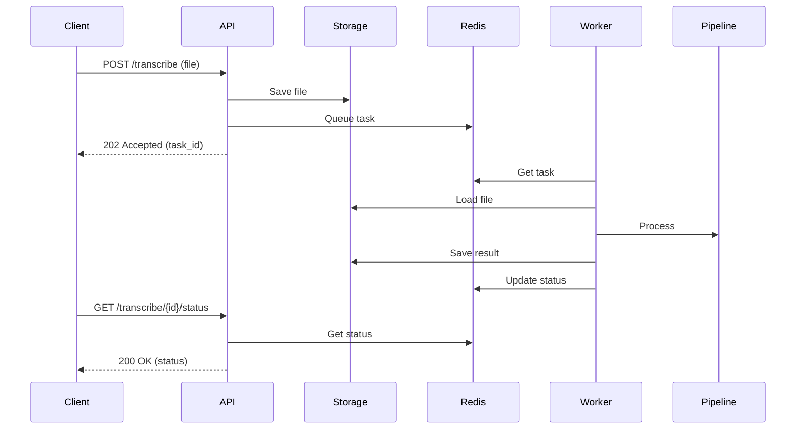

# Промпт: Документация

> Руководство по созданию документации с использованием AI-ассистента

---

## Типы документации

```
┌─────────────────────────────────────────────────────────────┐
│                   ПИРАМИДА ДОКУМЕНТАЦИИ                     │
├─────────────────────────────────────────────────────────────┤
│                      README.md                              │
│                   (точка входа)                             │
│                         │                                   │
│           ┌─────────────┼─────────────┐                     │
│           ▼             ▼             ▼                     │
│       GETTING       API DOCS      ARCHITECTURE              │
│       STARTED      (endpoints)    (decisions)               │
│           │             │             │                     │
│           ▼             ▼             ▼                     │
│       TUTORIALS    REFERENCE     ADR/RFC                    │
│      (how-to)     (details)    (why)                        │
│                         │                                   │
│                         ▼                                   │
│                    INLINE DOCS                              │
│                (docstrings, comments)                       │
└─────────────────────────────────────────────────────────────┘
```

---

## 1. README.md

### Промпт для генерации README

```
Создай README.md для проекта:

Информация:
- Название: [название]
- Описание: [что делает]
- Стек: [технологии]
- Структура: [основные папки]

Включи секции:
1. Заголовок с badges (build, coverage, version)
2. Краткое описание (1-2 предложения)
3. Features (bullet list)
4. Quick Start (минимум шагов для запуска)
5. Installation (подробные шаги)
6. Usage (примеры кода)
7. Configuration (env vars, config files)
8. API Reference (если есть)
9. Contributing
10. License

Стиль:
- Лаконично, без воды
- Примеры кода должны работать
- Команды copy-paste ready
```

### Шаблон README

```markdown
# Project Name

[](link)
[](link)
[](link)

One-line description of what this project does.

## Features

- Feature 1
- Feature 2
- Feature 3

## Quick Start

```bash
git clone https://github.com/user/repo
cd repo
pip install -r requirements.txt
python main.py
```

## Installation

### Prerequisites

- Python 3.10+
- Redis
- PostgreSQL

### Steps

1. Clone the repository
2. Create virtual environment
3. Install dependencies
4. Configure environment
5. Run migrations
6. Start the server

## Usage

```python
from project import Client

client = Client(api_key="xxx")
result = client.process("input")
print(result)
```

## Configuration

| Variable | Description | Default |
|----------|-------------|---------|
| `API_KEY` | API key | required |
| `DEBUG` | Debug mode | `false` |

## API Reference

See [API.md](docs/API.md)

## Contributing

See [CONTRIBUTING.md](CONTRIBUTING.md)

## License

MIT License - see [LICENSE](LICENSE)
```

---

## 2. API Documentation

### Промпт для документирования API

```
Задокументируй API endpoints:

Код:
```python
[вставь FastAPI routes или Flask views]
```

Для каждого endpoint создай:
1. Метод и путь
2. Описание (что делает)
3. Параметры (path, query, body)
4. Заголовки (если нужны)
5. Request body (с примером JSON)
6. Response (с примером JSON)
7. Error codes
8. Пример curl

Формат: OpenAPI-compatible markdown
```

### Шаблон endpoint документации

```markdown
## POST /api/users

Create a new user.

### Headers

| Header | Type | Required | Description |
|--------|------|----------|-------------|
| Authorization | string | Yes | Bearer token |
| Content-Type | string | Yes | application/json |

### Request Body

```json
{
  "email": "user@example.com",
  "name": "John Doe",
  "role": "user"
}
```

| Field | Type | Required | Description |
|-------|------|----------|-------------|
| email | string | Yes | Valid email address |
| name | string | Yes | Full name (2-100 chars) |
| role | string | No | User role (default: "user") |

### Response

**201 Created**

```json
{
  "id": "123e4567-e89b-12d3-a456-426614174000",
  "email": "user@example.com",
  "name": "John Doe",
  "role": "user",
  "created_at": "2024-01-15T10:30:00Z"
}
```

**Error Responses**

| Code | Description |
|------|-------------|
| 400 | Invalid request body |
| 401 | Unauthorized |
| 409 | Email already exists |

### Example

```bash
curl -X POST https://api.example.com/api/users \
  -H "Authorization: Bearer xxx" \
  -H "Content-Type: application/json" \
  -d '{"email": "user@example.com", "name": "John Doe"}'
```
```

---

## 3. Docstrings

### Промпт для генерации docstrings

```
Добавь docstrings к коду:

```python
[вставь код без docstrings]
```

Стиль: Google style docstrings

Для функций включи:
- Краткое описание (одна строка)
- Развёрнутое описание (если нужно)
- Args: параметры с типами и описанием
- Returns: что возвращает
- Raises: какие исключения может выбросить
- Example: пример использования

Для классов включи:
- Описание класса
- Attributes: публичные атрибуты
- Example: пример создания и использования
```

### Примеры docstrings

```python
def calculate_discount(
    price: Decimal,
    discount_percent: int,
    max_discount: Decimal | None = None
) -> Decimal:
    """Calculate discounted price.

    Applies percentage discount to the original price, optionally
    capped at a maximum discount amount.

    Args:
        price: Original price before discount.
        discount_percent: Discount percentage (0-100).
        max_discount: Maximum discount amount. If None, no cap applied.

    Returns:
        Final price after discount.

    Raises:
        ValueError: If discount_percent is not between 0 and 100.
        ValueError: If price is negative.

    Example:
        >>> calculate_discount(Decimal("100"), 20)
        Decimal("80")
        >>> calculate_discount(Decimal("100"), 50, max_discount=Decimal("30"))
        Decimal("70")
    """
    if not 0 <= discount_percent <= 100:
        raise ValueError("Discount must be between 0 and 100")
    if price < 0:
        raise ValueError("Price cannot be negative")

    discount = price * discount_percent / 100
    if max_discount is not None:
        discount = min(discount, max_discount)

    return price - discount


class OrderProcessor:
    """Process and validate customer orders.

    Handles order validation, discount calculation, and persistence.
    Integrates with payment and notification services.

    Attributes:
        db: Database session for persistence.
        payment_service: Payment processing service.
        config: Processor configuration.

    Example:
        >>> processor = OrderProcessor(db=session, config=config)
        >>> order = processor.create_order(customer_id=123, items=items)
        >>> processor.process_payment(order)
    """

    def __init__(
        self,
        db: Session,
        payment_service: PaymentService | None = None,
        config: ProcessorConfig | None = None
    ) -> None:
        """Initialize the order processor.

        Args:
            db: SQLAlchemy database session.
            payment_service: Optional payment service. Uses default if None.
            config: Optional configuration. Uses defaults if None.
        """
        self.db = db
        self.payment_service = payment_service or DefaultPaymentService()
        self.config = config or ProcessorConfig()
```

---

## 4. Architecture Documentation

### Промпт для документирования архитектуры

```
Создай архитектурную документацию для проекта:

Структура:
```
[вставь tree структуру проекта]
```

Ключевые файлы:
- [файл 1]: [описание]
- [файл 2]: [описание]

Включи:
1. Overview (что делает система)
2. Components (основные компоненты)
3. Data Flow (как данные проходят через систему)
4. Dependencies (внешние зависимости)
5. Deployment (как деплоится)
6. Diagrams (ASCII или Mermaid)

Формат: Markdown с диаграммами
```

### Шаблон архитектурной документации

```markdown
# Architecture Overview

## System Context

```
┌─────────────┐     ┌─────────────┐     ┌─────────────┐
│   Client    │────▶│   API       │────▶│  Database   │
│  (Browser)  │     │  (FastAPI)  │     │ (PostgreSQL)│
└─────────────┘     └──────┬──────┘     └─────────────┘
                           │
                    ┌──────▼──────┐
                    │   Worker    │
                    │  (Celery)   │
                    └──────┬──────┘
                           │
                    ┌──────▼──────┐
                    │    Redis    │
                    │   (Queue)   │
                    └─────────────┘
```

## Components

### API Layer (`backend/api/`)

Handles HTTP requests, authentication, and routing.

- `main.py` - FastAPI application entry point
- `routes/` - API endpoint handlers
- `middleware/` - Request/response processing

### Core Layer (`backend/core/`)

Business logic and domain services.

- `auth/` - Authentication and authorization
- `transcription/` - Audio processing pipeline
- `storage/` - File storage abstraction

### Task Layer (`backend/tasks/`)

Background job processing with Celery.

- `transcription.py` - Async transcription tasks

## Data Flow



## Key Design Decisions

### ADR-001: Celery for Background Tasks

**Context:** Need async processing for long-running transcriptions.

**Decision:** Use Celery with Redis broker.

**Consequences:**
- (+) Scalable workers
- (+) Retry logic built-in
- (-) Additional infrastructure
```

---

## 5. ADR (Architecture Decision Records)

### Промпт для создания ADR

```
Создай ADR для решения:

Решение: [что решили]
Контекст: [почему нужно было решать]
Альтернативы: [какие ещё варианты рассматривали]

Формат ADR:
1. Title (номер и название)
2. Status (proposed/accepted/deprecated)
3. Context (проблема)
4. Decision (что решили)
5. Consequences (плюсы и минусы)
```

### Шаблон ADR

```markdown
# ADR-001: Use PostgreSQL for Primary Database

## Status

Accepted

## Context

We need a database for storing user data, transcription results,
and application state. Requirements:
- ACID compliance for financial data
- JSON support for flexible schemas
- Full-text search for transcripts
- Proven reliability and ecosystem

## Decision

Use PostgreSQL as the primary database.

## Alternatives Considered

### MySQL
- (+) Widely used, good performance
- (-) Weaker JSON support
- (-) Less advanced features

### MongoDB
- (+) Flexible schema
- (+) Good for documents
- (-) No ACID across documents
- (-) Different mental model for team

### SQLite
- (+) Simple, no server needed
- (-) Not suitable for concurrent access
- (-) No network access

## Consequences

### Positive
- Strong ACID guarantees
- Excellent JSON/JSONB support
- Native full-text search
- Mature ecosystem and tooling
- Team familiarity

### Negative
- Requires server management
- More complex setup than SQLite
- Need to manage connections carefully

### Neutral
- Will use SQLAlchemy as ORM
- Need to set up migrations with Alembic
```

---

## 6. Inline Comments

### Промпт для добавления комментариев

```
Добавь комментарии к сложному коду:

```python
[код без комментариев]
```

Правила:
1. Комментируй ПОЧЕМУ, не ЧТО
2. Не комментируй очевидное
3. Объясняй сложную логику
4. Документируй workarounds и хаки
5. Указывай TODO с контекстом

Примеры хороших комментариев:
# Используем batch insert для производительности (10x быстрее)
# Retry нужен из-за нестабильного API поставщика
# HACK: Обходим баг в библиотеке X, см. issue #123
```

### Примеры комментариев

```python
# ❌ Плохие комментарии (очевидные):
i = i + 1  # Увеличиваем i на 1
user = get_user(id)  # Получаем пользователя

# ✅ Хорошие комментарии (объясняют почему):
# Добавляем задержку чтобы не превысить rate limit API (100 req/min)
time.sleep(0.6)

# Используем raw SQL вместо ORM для batch операции
# ORM создаёт N запросов, raw SQL - один
db.execute(text("INSERT INTO ... SELECT ..."))

# HACK: pyannote 3.1 падает на файлах > 4GB, разбиваем на чанки
# Исправлено в 3.2, но мы пока на 3.1 из-за зависимости whisperx
# TODO: Убрать после обновления whisperx (issue #456)
if file_size > 4 * GB:
    chunks = split_audio(audio, chunk_size=2 * GB)
```

---

## 7. CHANGELOG

### Промпт для генерации CHANGELOG

```
Создай CHANGELOG на основе git истории:

```
git log --oneline -50
[вставь вывод]
```

Формат: Keep a Changelog (https://keepachangelog.com/)

Категории:
- Added (новые фичи)
- Changed (изменения в существующем)
- Deprecated (скоро будет удалено)
- Removed (удалено)
- Fixed (исправления багов)
- Security (security fixes)

Группируй по версиям (семантическое версионирование).
```

### Шаблон CHANGELOG

```markdown
# Changelog

All notable changes to this project will be documented in this file.

The format is based on [Keep a Changelog](https://keepachangelog.com/),
and this project adheres to [Semantic Versioning](https://semver.org/).

## [Unreleased]

### Added
- Manager dashboard with analytics (#123)
- Email notifications for completed tasks (#124)

### Changed
- Improved error messages in API responses

### Fixed
- Memory leak in audio processing (#125)

## [2.1.0] - 2024-01-15

### Added
- Multi-tenant support
- Corporate branding customization

### Security
- Fixed XSS vulnerability in transcript display

## [2.0.0] - 2024-01-01

### Changed
- **BREAKING:** Renamed `/api/transcribe` to `/api/v2/transcribe`
- Updated to Python 3.11

### Removed
- Deprecated v1 API endpoints
```

---

## Чеклист документации

```markdown
## Проект
- [ ] README.md актуален
- [ ] LICENSE файл есть
- [ ] CONTRIBUTING.md есть
- [ ] CHANGELOG.md ведётся

## Код
- [ ] Все публичные функции имеют docstrings
- [ ] Сложная логика прокомментирована
- [ ] Type hints везде

## API
- [ ] Все endpoints задокументированы
- [ ] Примеры запросов/ответов
- [ ] Error codes описаны

## Архитектура
- [ ] Обзорная документация есть
- [ ] ADR для ключевых решений
- [ ] Диаграммы актуальны
```

---

## Источники

- [Write the Docs](https://www.writethedocs.org/)
- [Google Style Docstrings](https://google.github.io/styleguide/pyguide.html#38-comments-and-docstrings)
- [Keep a Changelog](https://keepachangelog.com/)
- [Architecture Decision Records](https://adr.github.io/)
